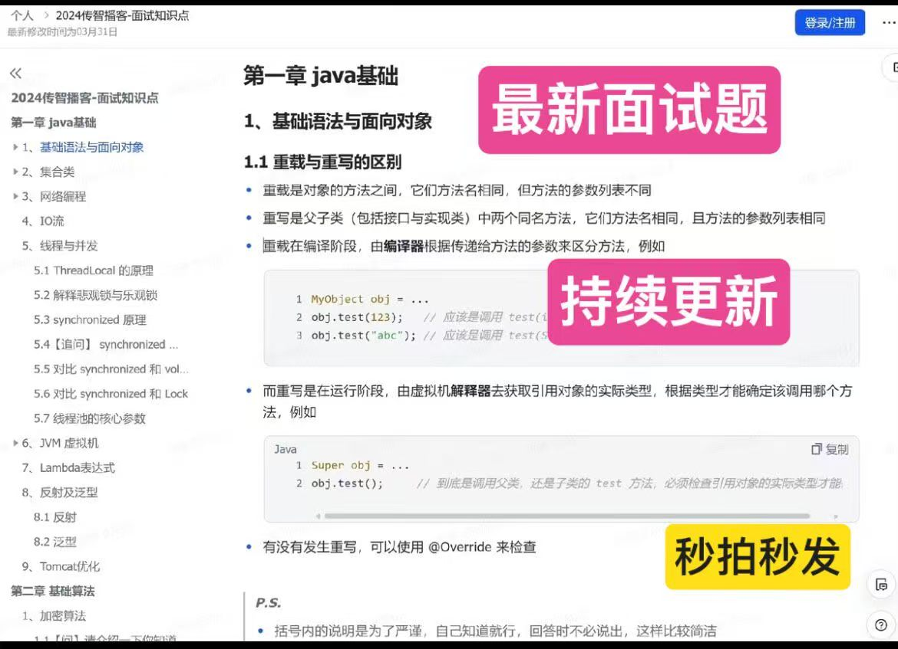
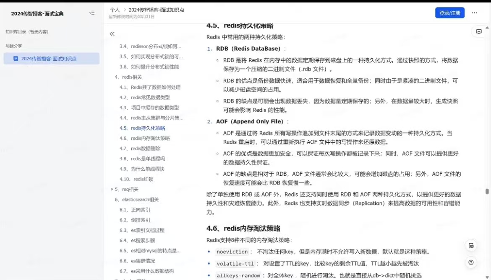
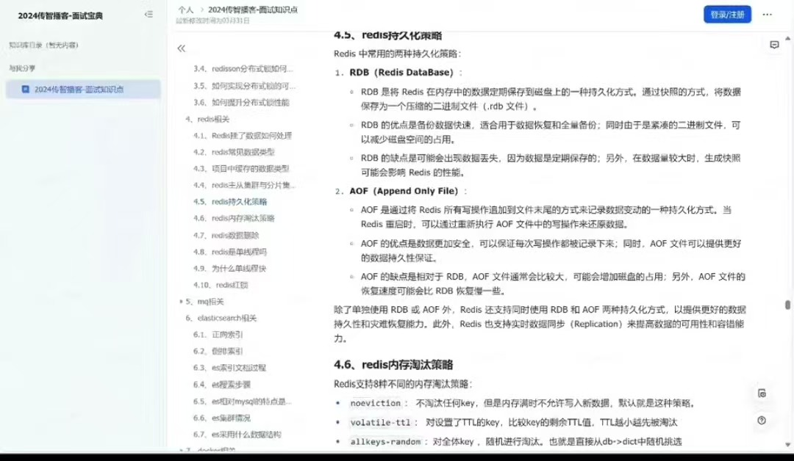
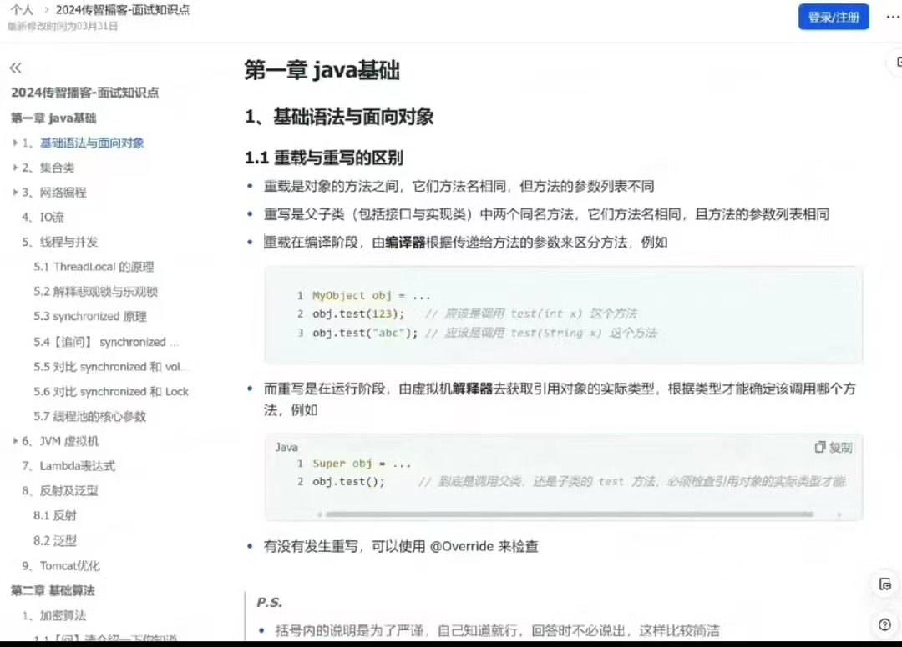
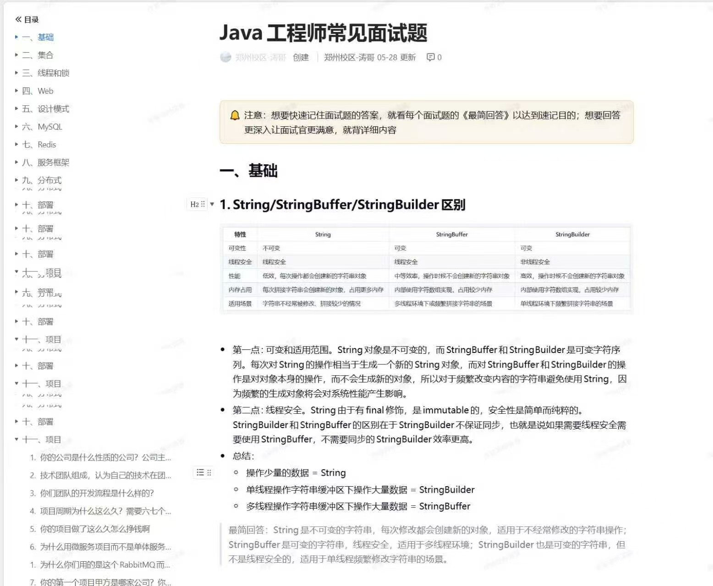
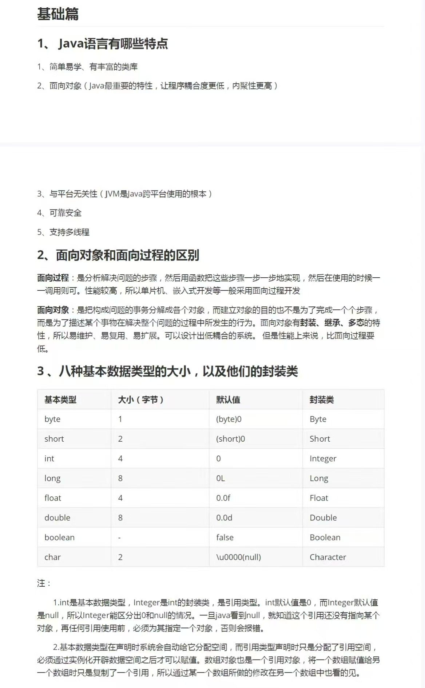

# javaInterview

2026年最新Java面试题、前端面试题、AI大模型面试题、AI Agent面试题、RAG面试题、C++面试题、Go面试题、Python面试题、测试面试题、运维面试题、后端面试题、操作系统面试题、计算机网络面试题、Redis面试题、MySQL数据库面试题、算法面试题、Spring面试题、JVM面试题、Java并发面试题、Linux面试题、LLM面试题、Prompt工程面试题、系统设计面试题等1万多道高频程序员求职必备八股文。面试刷题就选面试鸭 💎 React 前端 + Node 后端 + 云开发全栈项目

## Java笔试面试题资料在下方

夸克网盘链接：https://pan.quark.cn/s/afbfcced7fd3

百度网盘链接: https://pan.baidu.com/s/1KnD6jLBc4PIqh_VHp1B2MA?pwd=6jy8 提取码: 6jy8

### 项目合集(项目不断更新中，包含java、vue、python、Android、微信小程序等项目)

链接: https://pan.baidu.com/s/1nY-zhvAK0CXYcn3g7LzQnQ?pwd=id3c 提取码: id3c
--来自百度网盘超级会员v3的分享

#### 这些项目一起发你了 可以分享给你需要的同学 调试可找我 也接二次修改和项目定制、毕业设计等

### 工具包

链接: https://pan.baidu.com/s/1YmdoJvkjoUjA75wvHLDZ6A?pwd=xm96 提取码: xm96
--来自百度网盘超级会员v3的分享

需要远程项目部署或项目修改和毕业设计也可联系（添加申请时请备注好来意）

### 远程调试部署联系方式

链接: https://pan.baidu.com/s/1W0dDcoZmayG0c7USJDYBYg?pwd=nqd7 提取码: nqd7
--来自百度网盘超级会员v3的分享

